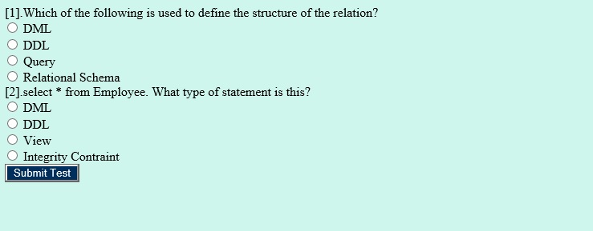

# Web–Enabled Exam Management System
Final Project for DataBase System Course 

### Objective
To create a system that provides a convenient method to hold and evaluate Online Exam for students.

### Purpose
The main purpose of the WEMS is to efficiently evaluate the candidate thoroughly through a fully automated system which saves time and also produces quick result.

### My Contributions

- Engaged in Data Modeling in MongoDB and software development using Spring MVC, Spring Boot, and AngularJS.

### Database Design

### Sample Screenshots

